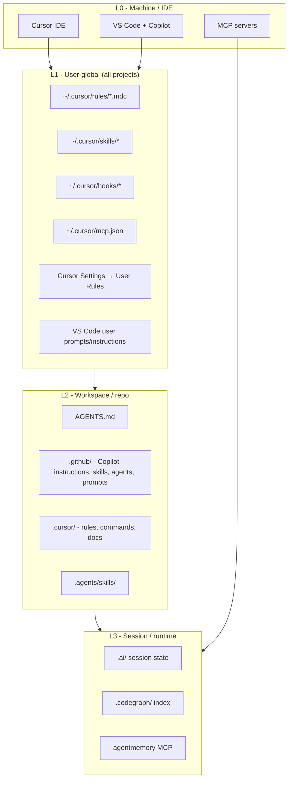

# AI Stack Architecture

Single reference for the layer model, install flow, and extension points of this repo. For the "why" - what each element optimizes compared to a bare editor - see [OPTIMIZATION-SURFACES.md](OPTIMIZATION-SURFACES.md).

**Last reviewed:** 2026-07-05
**Repo:** [`ai-dotfiles`](../README.md) - install engine, user baselines, plugins, and project scaffold

---

## 1. Mental model



**Precedence (highest wins on conflict):**

| #   | Layer                                | Where it lives                                    | Scope                          | When loaded                                            |
| --- | ------------------------------------ | ------------------------------------------------- | ------------------------------ | ------------------------------------------------------ |
| 1   | **Chat instruction**                 | Current message + thread                          | This session only              | Every prompt                                           |
| 2   | **User Rules (Settings UI)**         | Cursor Settings → Rules → User                    | All projects on this machine   | Always                                                 |
| 3   | **User rules (`.mdc`)**              | `~/.cursor/rules/*.mdc`                           | All projects on this machine   | `alwaysApply: true` rules always; others on glob match |
| 4   | **Project rules**                    | `<repo>/.cursor/rules/*.mdc`                      | Open repo only                 | Always or on glob                                      |
| 5   | **AGENTS.md + copilot-instructions** | Repo root + `.github/copilot-instructions.md`     | Open repo                      | Always-on repo guide                                   |
| 6   | **Scoped instructions**              | `.github/instructions/*.md`                       | Paths matching `applyTo` globs | When file scope matches                                |
| 7   | **Skills / agents / prompts**        | `.github/skills/`, `.agents/`, `.github/prompts/` | Task-dependent                 | On demand                                              |
| 8   | **MCP tool instructions**            | MCP server schemas                                | Tool calls in session          | Injected per invocation                                |
| 9   | **Default model behavior**           | Model vendor baseline                             | Everything not overridden      | Fallback                                               |

---

## 2. Install layers

`setup.sh` installs two independent layers:

### User baseline (machine-global)

Installed once per machine, shared across all your repos:

| What                 | Source                              | Destination                                |
| -------------------- | ----------------------------------- | ------------------------------------------ |
| Core rules           | `editors/cursor/user/rules/*.mdc`   | `~/.cursor/rules/`                         |
| Core skills          | `editors/cursor/user/skills/`       | `~/.cursor/skills/`                        |
| Core hooks           | `editors/cursor/user/hooks/`        | `~/.cursor/hooks/` + `hooks.json`          |
| MCP template         | `editors/cursor/mcp.json.example`   | `~/.cursor/mcp.json` (backed up if exists) |
| VS Code instructions | `editors/vscode/user/instructions/` | VS Code user prompts dir                   |
| Caveman skills       | fetched via `npx skills`            | `.agents/skills/` in current dir           |

### Repo scaffold (per project)

Installed into a target repo with `--repo /path/to/repo`:

| What                 | Source                                 | Destination                     |
| -------------------- | -------------------------------------- | ------------------------------- |
| Generic `.github/`   | `profiles/generic/github/`             | `<repo>/.github/`               |
| Profile overlay      | `profiles/<name>/github/`              | `<repo>/.github/` (merged)      |
| Cursor project rules | `editors/cursor/project/rules/`        | `<repo>/.cursor/rules/`         |
| Profile Cursor rules | `profiles/<name>/cursor/rules/`        | `<repo>/.cursor/rules/`         |
| Codegraph config     | `shared/codegraph/config.json.example` | `<repo>/.codegraph/config.json` |

---

## 3. Profiles

A **profile** is a named bundle under `profiles/<name>/` that overlays the generic scaffold with project-specific rules, agents, instructions, and prompts.

```
profiles/<name>/
  profile.json        # setup defaults, validation rules, parity pairs
  profile.manifest    # .github/ paths to remove after overlay
  AGENTS.md           # optional repo entrypoint
  github/             # overlaid onto .github/
  cursor/             # overlaid onto .cursor/
  test-personas/      # copied to .mlem/test-personas/
```

Use with: `setup.sh --profile <name> --repo /path/to/app`

See [PROFILE_CONTRACT.md](maintainers/PROFILE_CONTRACT.md) for the full contract.

---

## 4. Plugins

A **plugin** adds optional user-global integrations (hooks, rules, skills, MCP config) for specific tools like Obsidian or Atlassian. Plugins are not installed by default - opt in with `--plugin <name>`.

```
shared/plugins/<name>/
  plugin.json                   # id, displayName, description, requiredEnvVars
  cursor/
    rules/*.mdc                  # → ~/.cursor/rules/
    hooks/hooks-fragment.json    # merged into ~/.cursor/hooks.json
    hooks/*.sh                   # → ~/.cursor/hooks/
    skills/                      # → ~/.cursor/skills/
  vscode/
    instructions/*.md            # → VS Code user prompts dir
  mcp/
    cursor.json                  # MCP block reference (printed during install)
    vscode.json                  # MCP block reference (printed during install)
```

Available plugins:

| Plugin      | What it installs                                                                                           |
| ----------- | ---------------------------------------------------------------------------------------------------------- |
| `obsidian`  | Vault boundary rule, `workspaceOpen` hook to launch Obsidian, MCP block                                    |
| `atlassian` | Jira write-guard hook (`beforeMCPExecution`), `jira-browser-verify` skill, MCP block (`uvx mcp-atlassian`) |

Use with: `setup.sh --plugin obsidian --plugin atlassian`

See [PLUGIN_CONTRACT.md](maintainers/PLUGIN_CONTRACT.md) for the plugin authoring contract.

---

## 5. Hooks (Cursor)

Cursor hooks run shell scripts at lifecycle events. The core baseline installs two unconditional hooks:

| Event                  | Script              | Purpose                                                       |
| ---------------------- | ------------------- | ------------------------------------------------------------- |
| `sessionStart`         | `session-resume.sh` | Auto-inject `.ai/session-resume.md` into fresh sessions       |
| `beforeShellExecution` | `git-safety.sh`     | Block destructive git commands (hard reset, force push, etc.) |

Plugins add further hooks (Obsidian `workspaceOpen`, Atlassian `beforeMCPExecution`) only when explicitly installed.

---

## 6. Skills

| Location                            | Scope        | How loaded                                      |
| ----------------------------------- | ------------ | ----------------------------------------------- |
| `~/.cursor/skills/` (user baseline) | All projects | Cursor picks up from user skills dir            |
| `<repo>/.github/skills/` (profile)  | Repo only    | Agent references by path or routing instruction |
| `<repo>/.agents/skills/` (caveman)  | Repo only    | Installed by caveman via `npx skills`           |

Core user skills: `session-handoff`, `workspace-focus`.
Plugin skills: `jira-browser-verify` (atlassian plugin).

---

## 7. MCP servers

| Server      | Type         | Source                         | When to add                     |
| ----------- | ------------ | ------------------------------ | ------------------------------- |
| Figma       | HTTP (cloud) | `mcp.figma.com`                | When using Figma designs        |
| codegraph   | stdio        | `codegraph` CLI on PATH        | Structural code intelligence    |
| agentmemory | stdio        | `npx @agentmemory/mcp`         | Persistent cross-session memory |
| obsidian    | HTTP (local) | Obsidian Local REST API plugin | Obsidian plugin install         |
| atlassian   | stdio        | `uvx mcp-atlassian`            | Atlassian plugin install        |

MCP blocks for plugins live in `shared/plugins/<name>/mcp/`. The install prints the block to add to your `mcp.json` manually (no auto-merge to avoid clobbering existing config).

---

## 8. Design principles

- **On-demand structural intelligence** (Codegraph MCP) - not auto-injected every prompt
- **Token reduction** - caveman mode, `.cursorignore`, compressed subagent output
- **Surgical edits** - Karpathy guidelines, `MIN_TOKENS`, StrReplace-first
- **Scope gates** - operator-choice-gate before parameterized work; project profiles add project-specific gates
- **Cost gates** - model tiering (T0/T1/T2) per plan task; handoff + model switch at phase boundaries
- **Commit gates** - AI pre-commit review before every commit (opt-in via `--git-hooks`, see item 4 in session-resume)
- **Profile-driven install** - generic scaffold + named profile overlay → target repos
- **Plugin opt-in** - tool-specific integrations never install by default
